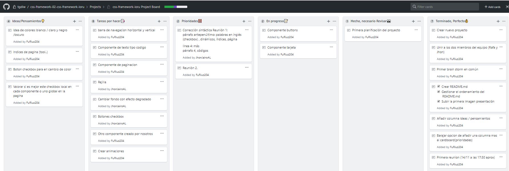
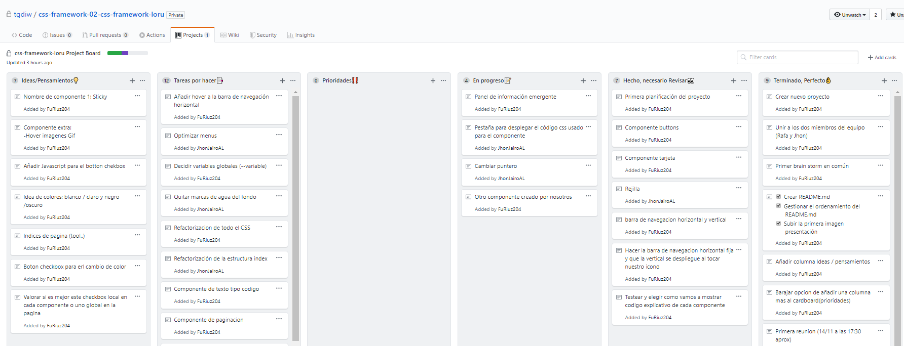

###### Fecha creación del README: 13/11/2019
##### Componentes del equipo: Rafael Ruiz, Jhon Aristizábal  
___
###### Actualizado 14/11/2019 14:00  

Utilizaremos este README.md como si fuera nuestro diario en el que quedará registrado la planificación, el seguimiento, y las reuniones de nuestro proyecto semanalmente.  

Un vistazo principal de nuestro apartado de Cardboard en el que se ve nuestro nombre de repositorio, y en la ventana "proyecto", el que acabamos de crear:
  

Dentro del Cardboard se pueden apreciar las distintas secciones, entre las que se encuentran:  
- Tareas por hacer  
- En progreso  
- Hecho, necesario Revisar  
- Terminado, perfecto    
Así quedaría nuestro Cardboard actualmente:
  

## Reunión 1.
Tras la reunión numero 1, la primera de muchas, hemos avanzado gran parte del proyecto en temas de desarrollo y planificación de cara a futuro.      
   
Para empezar, hemos pensado que es buena idea hacer los componentes en páginas separadas, para testear libremente y para tener menos líneas de código, para ser más precisos a la hora de escribir nuevas o cambiar continuamente la página.  
Hemos empezado dialogando de por qué componente empezar, optando por los botones y la carta con la imagen. Lo hicimos por separado. Los botones con hover y varios estados en el fichero llamado buttons.html con su respectivo buttons.css, y la carta con el fichero llamado card.html y card.css.  
Los códigos creados por separado seran juntados al final con el fin de crear una sola página homogénea para entregarla con las directrices pedidas en el enunciado.

Hemos actualizado la pestaña de los cardboards, en la que hemos añadido nuevas columnas, las cuales son:  
- Ideas/Pensamientos (En la que unicamente escribiremos el resultado de los brainstorm)
- Prioridades (En la que se encuentran tareas por hacer pero que deben ser empezadas lo antes posible)  

También hemos desplazado las dos tarjetas que estaban en la columna de "En progreso" anteriormente ya que están completadas, además de las tarjetas de añadir las dos columnas que acabamos de crear.  

En la columna nueva "Ideas" hemos añadido los checkbox que queremos utilizar dinamicos, para que cuando los pulses cambie de color el componente (o la pagina completa), los índices de página, para que dentro de ella puedas navegar de abajo a arriba con botones redireccionados, y los colores que nos gustan a día de hoy de los dos estados.  

En tareas por hacer hemos añadido el nombre de cada uno de los componentes que hay que realizar, ya que al principio no lo hicimos, y hemos desplazado a "en progreso" en los que estamos trabajando, que son los botones y la tarjeta con imagen.  

Este sería un resumen de la última actualización del cardboard:
  

Y por este día de trabajo y reunión hemos avanzado bastante. Siguiente reunión programada para el día 15/11/2019. Para entonces queremos tener terminados los componentes de los botones y las tarjetas.
###### Actualizado 14/11/2019 21:00 
___

###### Actualizado 15/11/2019 22:30 

La reunión programada para hoy, viernes 15 no se ha podido llevar a cabo por motivo de no coincidir en el horario. Se pospone a al día siguiente.    
Aun así, hemos trabajado por separado, probando y testeando cosas para mejorar los componentes en los que estamos trabajando ahora, que son los botones y la tarjeta.
También hemos corregido alguna falta de ortografía del texto anterior y hemos añadido la captura de pantalla del Cardboard de ayer, que se olvidó adjuntarla.

###### Actualizado 15/11/2019 22:30 
___

###### Actualizado 16/11/2019 23:00 
## Reunión 2.

En esta segunda reunión hemos empezado decidiendo la estructura del código CSS, para que todo esté de la misma manera y ordenado sintácticamente igual. Lo haremos siguiendo este ejemplo  
body {  
    color: #000;  
}  
Estamos incluyendo espacios delante de la llave y detrás de los dos puntos (:) de cada sentencia.    

También hemos añadido a la columna "Ideas" la nota de añadir un botón checkbox con JavaScript para que cambie el color de toda la página. Debemos quitar la marca de agua de los fondos que utilicemos, o revisarlos antes de entregar para que no haya ninguna, por lo que lo hemos añadido a la columna "Tareas por hacer". 
    
Hemos estado hablando sobre el botón que queremos hacer para que cambie toda la página a blanco y negro desde su estado normal que sería a color. Aunque es un poco complejo por ahora, esta idea esta en fase de pruebas.    
Hemos cumplido el propósito que teniamos de completar los componentes en los que estábamos trabajando, por lo que se han movido las tarjetas desde "En progreso" a "Hecho, pero no revisado" del componente de los botones y el componente de la tarjeta, solo haría falta implementación en el codigo final, además de pequeñas modificaciones.  
Por motivo de esto, estamos trabajando actualmente en el componente de la barra de navegación tanto horizontal como vertical, y en el panel de información emergente (con su respectiva animación), por lo que ambas pasan a la columna "En progreso".    

En cuanto al css se refiere, también tenemos que valorar las variables globales que vamos a declarar en el código, aunque lo hemos dejado en segundo plano ya que ahora no influye en nada, por lo que lo haremos una vez tengamos todo el código maquetado.    

Siguiente reunión programada para el día 18/11/2019.

###### Actualizado 16/11/2019 23:00 
___

###### Actualizado 17/11/2019 20:30 

Hoy hemos estado trabajando conjuntamente en los componentes que dejamos a medias ayer, pero no hemos hablado nada sobre el tema del proyecto o estructura, por lo que no cuenta como reunión si no como día de trabajo.    

Aun así, hemos terminado las barras de navegación, en lo que a la estructura de cada una de ellas se refiere, falta terminar de retocar pequeños detalles y colores, y juntarlas para que una de ellas sea desplegable, por lo que esta última tarea para a la seccion "Tareas por hacer" y las barras, como no vamos a seguir modificándolas por ahora, pasan ambas a "Hecho".    

Vamos a añadir hoy la foto que no pusimos en la reunión de ayer ya que hemos modificado hoy cosas y no sería cronológico:  
    

Para la próxima reunión queremos tener completa la unión de ambas barras y el componente del panel de información desplegable con el botón.

###### Actualizado 17/11/2019 20:30 
___

###### Actualizado 19/11/2019 23:30 

## Reunión 3.

Hemos aplazado la reunión de ayer principalmente porque vamos bastante adelantados en el proyecto, llevamos más del 70% aproximadamente de la práctica porque tenemos la mayoría de componentes hechos y algunos de ellos ya implementados en una página conjunta. Ahora estamos trabajando en seguir mejorando los componentes actuales y sobretodo: poner énfasis en que no sea todo monótono (no hacer copia y pega entre todos los componentes) y añadir animaciones para que sea atractiva visualmente. Tenemos por delante 12/13 días hasta la fecha de entrega de la práctica por lo que no es necesario obligarnos si no nos apetece diseñar.    

De la reunión pasada hemos completado ambas barras de navegación, tanto la horizontal como la vertical y las hemos unido en una misma página, permaneciendo esta última oculta y haciéndose visible cuando queramos, por lo que movemos esta tarjeta a "hecho, necesario revisar", aunque hemos añadido a "tareas por hacer" la de añadir un hover a la barra de navegacion horizontal, que lo haremos mas adelante para que sea semejante al resto de la gama de la página.    

Hemos añadido a la columna "Ideas" del cardboard la tarjeta de cambiar el cursor, ya que hemos navegado por una página que lo tenía implementado y nos ha parecido interesante, aunque lo hemos intentado implementar, tras un rato de testeo no ha resultado efectivo y lo hemos descartado por ahora. También hemos añadido que los títulos de los componentes sean sticky (que se anclen a la barra superior al desplazarnos por dicho componente), una muestra de imagenes que al pasar el raton por encima que se anime un gif, y por último para la columna "ideas" es la de hacer una caricatura nuestra tipo tarjeta de contacto / autor de la web en el footer de la página.    

Actualmente seguimos trabajando en el componente del panel de información emergente, a la vez que creamos uno nuestro propio para mostrar una alerta.  
También estamos diseñando el modelo con el que vamos a mostrar el código (css,html,js) de nuestros componentes en la página web, optando por uno de ventanas / pestañas deslizables.    

Tenemos además: un background fijo con un panel deslizable encima transparente, que nos ha resultado interesante probar, unos botones para desplegar un panel en la parte inferior temporal o fijo y unos gifs animados que además son interactivos en cuanto a hover se refiere.    
Nota: Hay columnas que son bastante largas y no caben dentro de la imagen ya que se vería muy pequeño y poco nítido. De ahora en adelante seran recortadas por la parte inferior.  Nuestro resumen del cardboard actual queda así:

    

Este sería el trabajo y la reunión realizada hoy. Estamos reuniendonos cada dos días y nos está funcionando bastante bien así que intentaremos seguir con este ritmo hasta el final.  

###### Actualizado 19/11/2019 23:30 
___

###### Actualizado 21/11/2019 23:55

## Reunión 4.

Esta reunión no la hemos dedicados a debatir sobre el proyecto en general, si no que nos hemos centrado en los componentes y hemos avanzado en ellos y perfeccionándolos.    

Hemos estado trabajando en el componente del panel de información que resalte del resto del texto. Este le queremos hacer oculto y que aparezca al pinchar un botón, para ello aplicaremos algo de Javascript básico. Está casi terminado pero falta amoldarlo a la estructura que tenemos de la página en cuanto a formato y colores, pero el esqueleto esta testeado y funciona bien.    

En el cardboard no hemos modificado nada, simplemente hemos añadido a la columna "Ideas" la tarjeta de añadir una especie de estadística del codigo y el lenguaje que hemos utilizado mediante gráficos.

Como hemos hablando en clase, el bootstrap era solo orientativo, para reflejar la nomenclatura que usa para sus clases y nosotros estábamos utilizando cosas implementadas. Por eso al componente card se le han quitado las clases bootstrap y se han añadido clases propias que harán cosas similares.    

Poco a poco también estamos añadiendo todos los componentes que vamos probando y testeando al archivo menu_horizontal.html, que a partir de ahora pasa a llamarse index.html.  
Faltaría refactorizar y mejorar el css en cuanto a estructura general, limpieza y sintaxis homogénea.    

El resto de tiempo hemos estado probando efectos interesantes y animaciones que poder meter a los componentes ya creados con fin de mejorar la estética final.    

Por puntualizar, hemos cambiado el editor de trabajo que teníamos, pasando de la aplicación de "Sublime Text 3" a "Brackets". Esta última esta muy dedicada a CSS y HTML, permitiendonos cambiar cosas en los archivos a tiempo real, al igual que los fallos o errores, ver componentes asociados, a que linea se hacer referencia cada elemento en la página al selecionarlo...  
Este cambio ha sido la consecuencia de la aparición de varios errores de apertura de ficheros o de colocación de las carpetas y la ruta de los mismos, por lo que hemos perdido un poco de tiempo, pero para el futuro nos ahorrará trabajo y nos facilitará otras cosas.    

Por último y por añadir también, somos los que más avanzados llevamos el proyecto, en base a las estadísticas que nos ha proporcionado el profesor de la asignatura. Este dato nos ha motivado sabiendo que lo llevamos bien y nos va a ayudar a seguir trabajando para mantener esa posición ficticia a lo largo de todo el proyecto, hasta la fecha de entrega.    

Como no hemos modificado casi nada del Cardboard no vamos a añadir captura en esta reuunión.  
Para el escaso tiempo que hemos dedicado hoy hemos mejorado bastante y ya vamos teniendo cosas más claras con visión al trabajo terminado.  

###### Actualizado 21/11/2019 23:55
___

###### Actualizado 25/11/2019 23:50

## Reunión 5.

Durante este fin de semana hemos estado trabajado por separado porque no hemos podido coincidir para programar juntos. Además tenemos próximamente examenes y hay que repartir el tiempo en otras asignaturas. Quedan 6 días para entregar el proyecto y solo nos queda por hacer el componente de la paginación.    

El componente card / tarjeta está terminado prácticamente y ya tenemos pensado la forma de presentar dicho componente. Se han optimizado los estilos y el codigo html,  ya que posiblemente no se hagan cambios en este o solamente se implementen pequeñas mejoras visuales.   

El componente de tablón de efecto cristal opaco se encuentra en su fase prefinal porque necesita una pequeña refectorización del código e indentado, pero no se modificará más en dicho apartado. Tenemos pensado utilizarlo conjunto a las tarjetas de presentación para mostrar y explicar su código.    

Por último se ha creado un div con un fondo y dos componente que ya se puede añadir al index, su diseño es casi definitivo, se han usado las tarjetas y debajo un tablón con pestañas explicando el código utilizado. Aunque está en su fase pre-final puede sufrir cambios antes de implementarlo en el index.    

Dentro del cardboard, hemos añadido a "en progreso" el componente del cristal transparente, y el componente de paginación, que será lo próximo con lo que empecemos a trabajar. La tarjeta y el panel de información emergente se han desplazado a "Hecho, necesario revisar".  
A "Tareas por hacer" hemos añadido Aplicar boxsizing heredado o no, para ver como funciona nuestra página y adornar nuestro código e identar todo nuestro código para el mismo fin que el anterior. Por último, queremos añadir unos índices para navegar dentro del documento que se encuentren en un partado desplegable en el menú para que sean rápidamente accesibles.  
Este es el resumen general de nuestro cardboard actual:

    

###### Actualizado 25/11/2019 23:50

___

###### Actualizado 29/11/2019 19:00

## Reuniones 5 y 6.

Ayer, día 28, estuvimos trabajando gran parte de la tarde y noche pero no escribimos nada en el README por lo que lo actualizaremos con la reunión de hoy.    

El componente de "texto_oculto" que se encontraba en desarrollo ha cambiado de maquetación para pasar a ser el componente de "banner", que son unas imágenes horizontales con pequeña altura a modo de pancarta. Además contendrá la cita de un autor dentro del mismo y el nombre del autor oculto, que será visible con una animación de movimiento. Se han dotado los contenedores con transiciones en los ejes X y Z para conseguir que al pasar el ratón el banner se tumbe hacia atrás. Generando una sombra y revelando el nombre del autor.    

Se está trabajando en ir eliminando poco a poco las clases y propiedades que heredamos de boostrap y no era muy correcto utilizarlas por lo que estamos sustituyéndolas por las nuestros codigos de css.    

Hemos añadido un submenú a la barra de navegación vertical , (añadido también al cardboard a la columna "en progreso") para que al pasar por uno de los links del menú, se despliegue. También hemos añadido distintos tipos de estilos y colores al banner que teníamos deslizable en la portada del index.html.    

Se ha incluido también un icono de una luna que representa el cambio de estado de modo nocturno / normal, el cual bajará el brillo ligeramente a la pantalla. Hay varias pruebas incluidas de cambio del cursor al hacer hover en cosas, pero se encuentra en una fase de testeo y pruebas.    

Por último, añadimos un botón en la barra de navegación horizontal que es utilizado para cambiar la apariencia global de la página, ya que aplica un filtro a todo el body

  

###### Actualizado 29/11/2019 22:00

Hemos creado un fichero nuevo llamado inicio.html en el que estamos añadiendo los componentes que ya están terminados para ir viendo el resultado final ya estructurado.    

Hemos añadido la tarjeta, los botones, los botones de mensajes desplegables, el panel con el código desplazable (CSS, HTML...), el panel desplegable informativo, las barras de navegación, los banner, el banner de la portada y los huevos de los componentes vacíos.    

También hemos hecho un repaso rápido a lo que nos gustaría cambiar después del descanso que nos queríamos tomar:
- En la portada hay que quitar el boton y los bordes de "Loru" y dejar solo las letras.
- En la barra de navegacion superior , meter hover al background y animación.
- Reducir el tamaño height del banner degradado de los componentes.
- Ver si queda bien cambiar en cada banner el degradado adaptandolo al fondo (colores diferentes en cada uno).  

Dentro del componente de Cristal:
- Cambiar focus de la pestaña a más oscuro.  
- Separar los botones de pestañas del comienzo de la letra para que no se superpongan.

Dentro del componente 1. Boton:
- Meterle margenes superiores y separar el componente del cristal (explicacion de codigo HTML, CSS etc).
-Aumentar el tamaño de la letra.

Dentro del componente 2. Tarjetas:
- Aumentar el tamaño del borde y cambiar el fonde del botón.
- Añadirle efectos distinto a cada hover de las imagenes de las tarjetas.    

Falta por hacer el componente de paginacion y por meter los componentes de: Botones de cookies, el código con la etiqueta < code > y el panel modal emergente.

