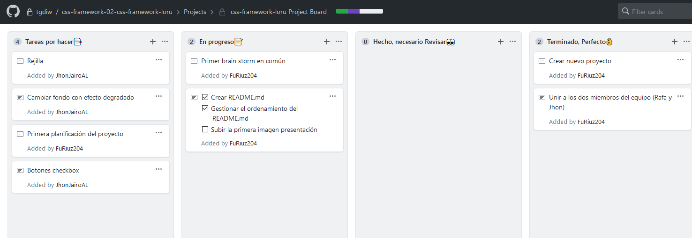

###### Fecha creación del README: 13/11/2019
##Componentes del equipo: Rafael Ruiz, Jhon Aristizaba  
___  

###### Actualizado 14/11/2019 14:00

___
###### Actualizado 14/11/2019 14:00  
Este será nuestro diario en el que quedará registrado la planificación, el seguimiento, y las reuniones de nuestro proyecto.  

Este es el vistazo principal de nuestro apartado de Cardboard.
  

Dentro del Cardboard se pueden apreciar las distintas secciones, entre las que se encuentran:  
- Tareas por hacer  
- En progreso  
- Hecho, necesario Revisar  
- Terminado, perfecto
  

